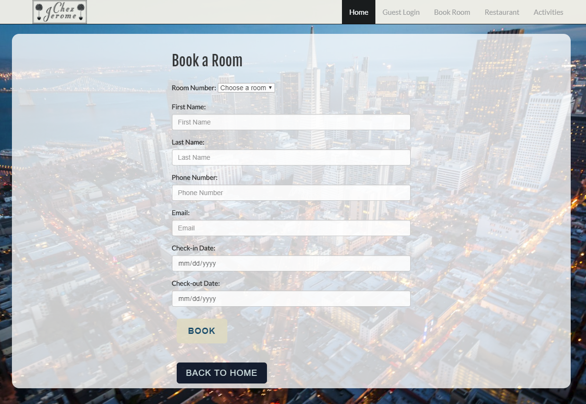
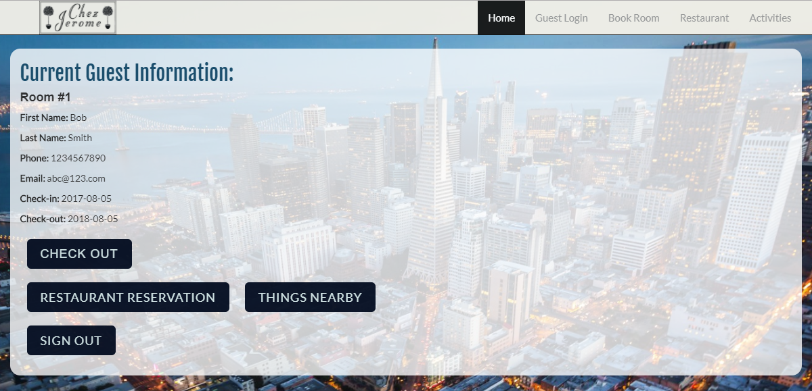
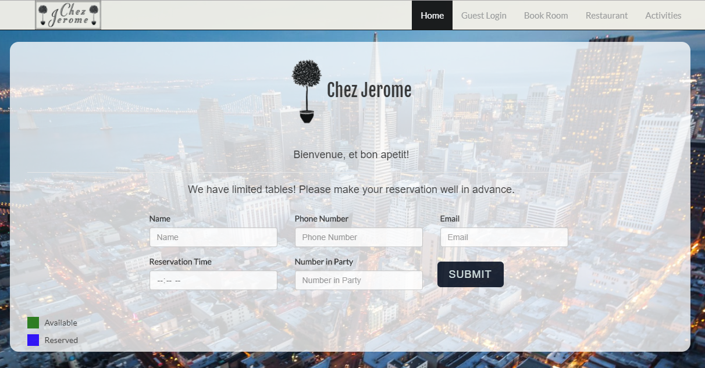
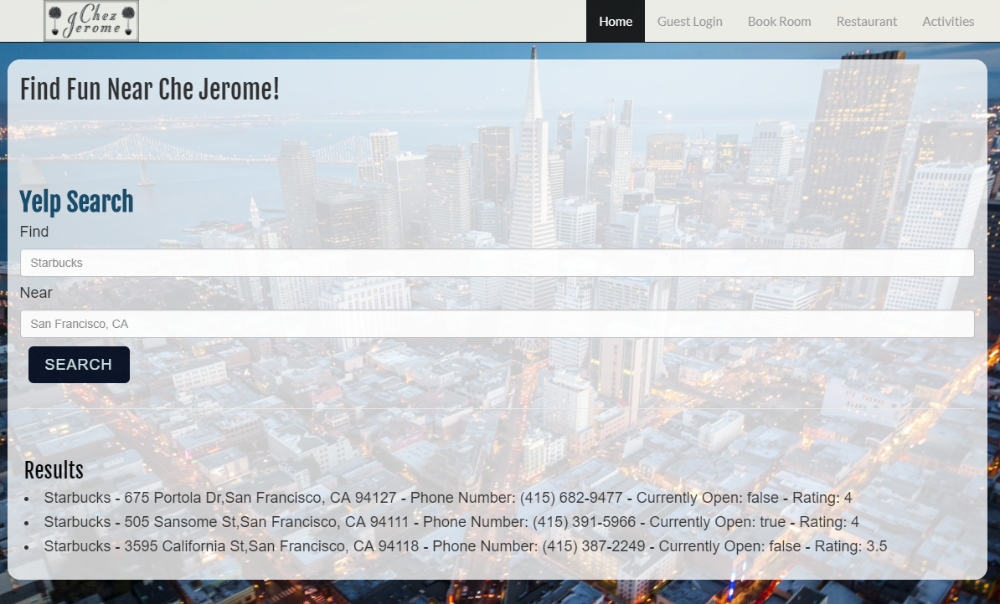
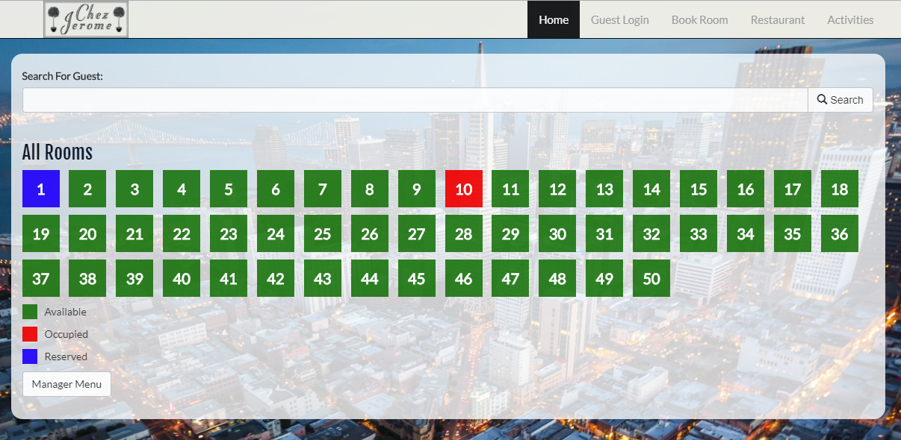

# Chez Jerome
An internal hotel management application using Node.js, Express, Sequelize, Handlebars.js and Passport.js

### Table of Contents 

1. [About](#about)
2. [Guest View](#guest)
3. [Manager View](#manager)
4. [Demo](#demo)

### About
Allows guests to book a room, reserve a table at the hotel's restaurant, and search for nearby things to do using Yelp's Fusion API.
Allows managers to view room availability, current guests, checkin and checkout guests, and restaurant table reservations.

### Guest View
Booking a room: 

Once a guest books a room, they can login and view their room info and guest options: 

Guests can reserve a table at the restaurant: 

They can also search for nearby locations: 

### Manager View
The manager view is hidden from the main view. The Manager Portal route is: `/admin`
 
Managers need to be signed up to login. Mangers can view room availability, check in and check out guests, and view current reservations at the restaurant. 
  
An admin account has already been created on the demo:
 Email: admin@admin.com
 Password: admin

### Demo
https://fierce-woodland-16916.herokuapp.com
 
Manager Portal: https://fierce-woodland-16916.herokuapp.com/admin
